<div align="center">

<br>

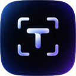

# Typical

### The typing test that proves you never looked at the keyboard.

<br>

[](https://typical-beige.vercel.app)
[](https://nextjs.org)
[](#privacy-by-construction)
[](#license)

**[Try it](https://typical-beige.vercel.app)** &nbsp;·&nbsp; **[Verified runs](#verified-runs)** &nbsp;·&nbsp; **[The test](#the-test)** &nbsp;·&nbsp; **[Stats](#stats-that-teach)** &nbsp;·&nbsp; **[Leaderboard](#a-leaderboard-you-can-trust)** &nbsp;·&nbsp; **[Themes](#eight-palettes)**

<br>

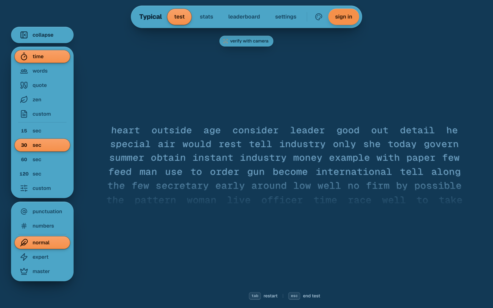

</div>

<br>

Every typing test measures how fast your fingers move. None of them can tell whether your eyes stayed
on the screen. **Typical can** — and it does it without a single frame of video ever leaving your
browser.

Open the site and start typing. No account, no install, no setup. Turn the camera on when you want
your runs to count as *verified*.

<br>

## What you get

<table>
<tr>
<td width="50%" valign="top">

**Verified, not just fast**<br>
An on-device face model watches for glances down at your keyboard. Runs are stamped **clean**,
**assisted** or **untracked**, and a verified score shows what each look-away really cost you.

</td>
<td width="50%" valign="top">

**A test that gets out of the way**<br>
A smooth gliding caret, words that scroll on their own, and everything else dimming to almost
nothing the moment you start. <kbd>tab</kbd> restarts, <kbd>esc</kbd> ends.

</td>
</tr>
<tr>
<td width="50%" valign="top">

**Stats that teach**<br>
Your weakest keys lit up on a keyboard, the words you actually fumble — one click turns them into a
practice test — plus your trend, your streak and every run you've ever done.

</td>
<td width="50%" valign="top">

**Yours from the first keystroke**<br>
Everything works as a guest, with history kept right in your browser. Sign in later and your past
runs come with you, onto a global leaderboard filtered by integrity.

</td>
</tr>
</table>

<br>

## Verified runs

Turn on **verify with camera**, look at the screen and then at your keyboard once to calibrate, and
type. Typical reads your head pose and eye openness on your own device and notices *sustained*
looks down at the keys — not every flicker of the eyes.

| Result | What it means |
|---|---|
| **clean** | Your eyes never left the screen. The badge real touch-typists deserve. |
| **assisted** | You glanced down. Typical tells you how many times and for how long — and docks your *verified score* accordingly, while your raw speed stays a fact. |
| **untracked** | Camera off. Every feature still works; the run just isn't verified. |

Want it stricter? Turn on **pause on peek** to freeze the test whenever you look down, or play on
**master**, where a single look away ends the run.

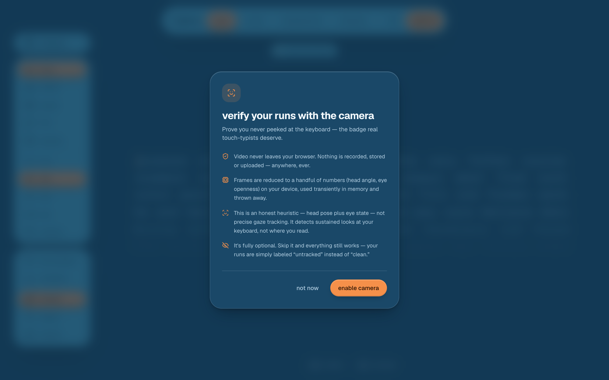

<br>

## The test

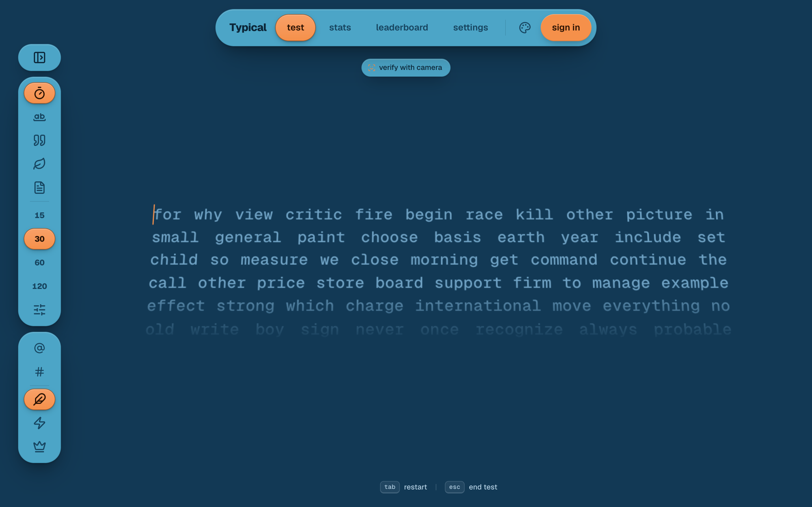

Every setting lives in a floating rail on the left. Collapse it to icons and the words glide over to
the middle of the free space.

| Mode | |
|---|---|
| **time** | 15, 30, 60 or 120 seconds — or any length you like |
| **words** | 10, 25, 50 or 100 words — or a custom count |
| **quote** | Real passages, short to long |
| **zen** | No target, no timer. Just type until you stop |
| **custom** | Paste any text and type that |

Add **punctuation** and **numbers** for realistic prose, then pick how forgiving it is:

- **normal** — mistakes are allowed
- **expert** — the run fails on any word committed with an error
- **master** — the run fails on any mistake, or any look away with the camera on

<br>

## Results worth sharing

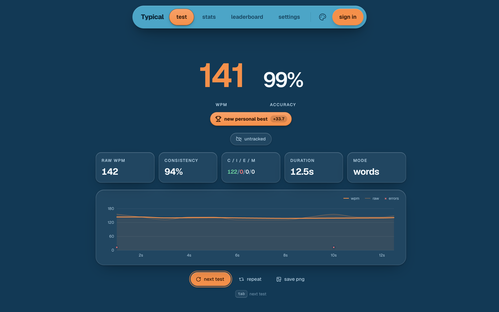

Your speed and accuracy, front and centre. A new personal best gets its moment, the chart shows
exactly where you sped up and where you stumbled, and **save png** turns the run into a card made for
posting.

<br>

## Stats that teach

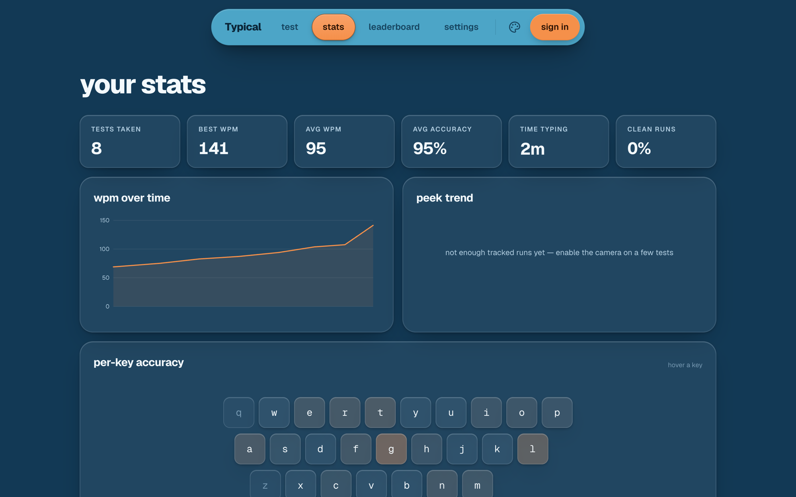

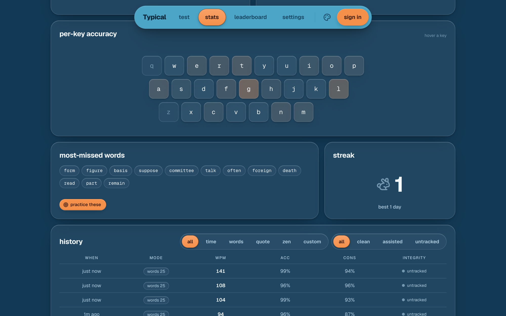

- **Per-key accuracy** — every key tinted by how often you miss it; hover one for the exact numbers
- **Most-missed words** — the words you really fumble, and **practice these** to drill them
- **Trends** — your speed over time, and how often you peek, falling as you learn
- **Streak** — days practiced in a row
- **History** — every run, filterable by mode and integrity, with a speed sparkline for each

<br>

## A leaderboard you can trust

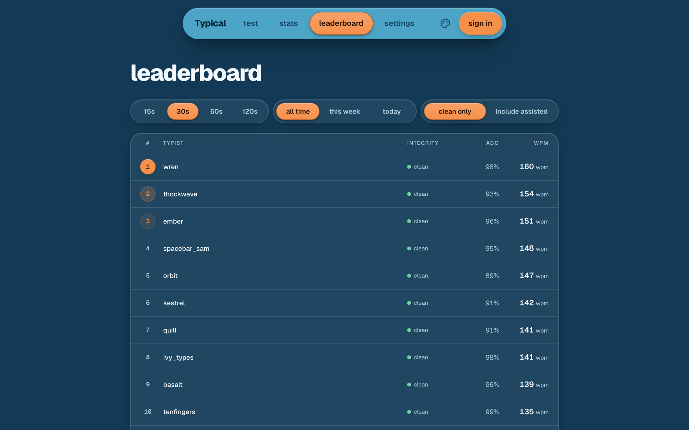

Best runs per typist across 15, 30, 60 and 120 seconds — today, this week or all time — showing
**clean runs only** by default. Every submitted run is re-checked on the server for physically
plausible speed and bot-like keystroke timing before it can rank.

<br>

## Eight palettes

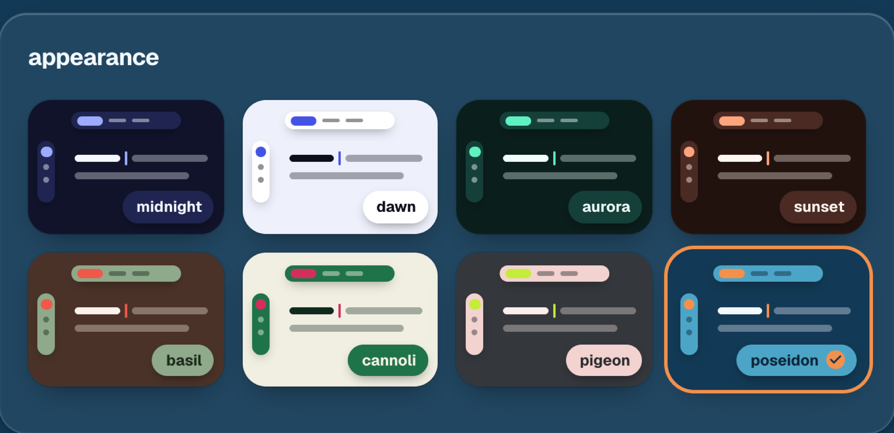

Each theme is built from a three-colour palette — a background, the floating surfaces, and an accent
that marks every choice you make. Pick one from the palette button in the nav or from settings.

<table>
<tr>
<td width="50%">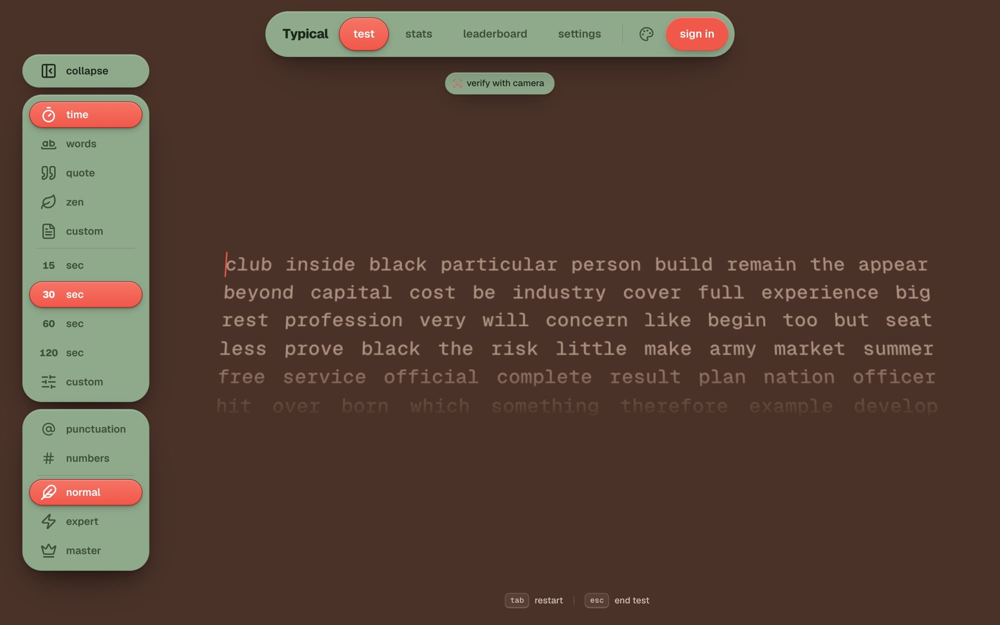</td>
<td width="50%">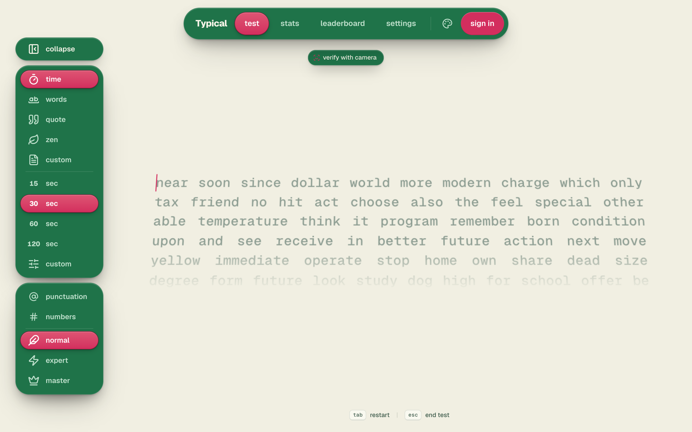</td>
</tr>
<tr>
<td width="50%">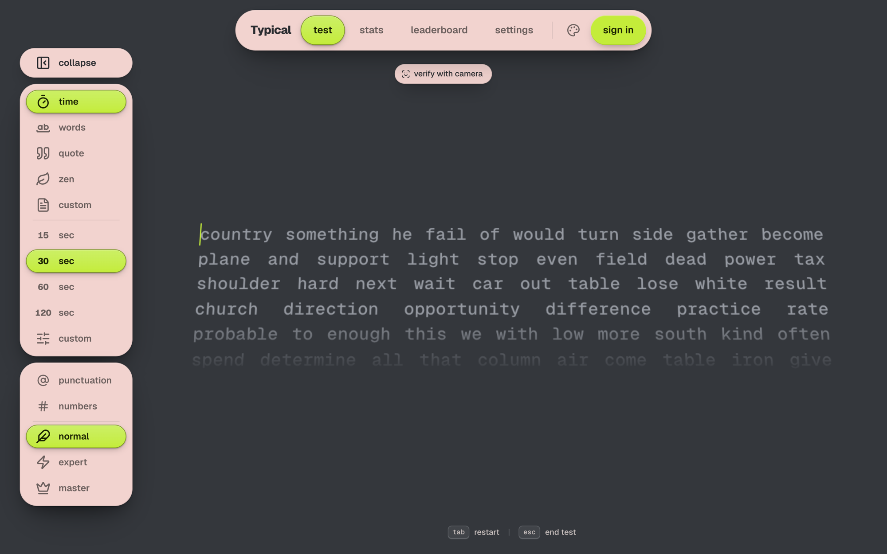</td>
<td width="50%">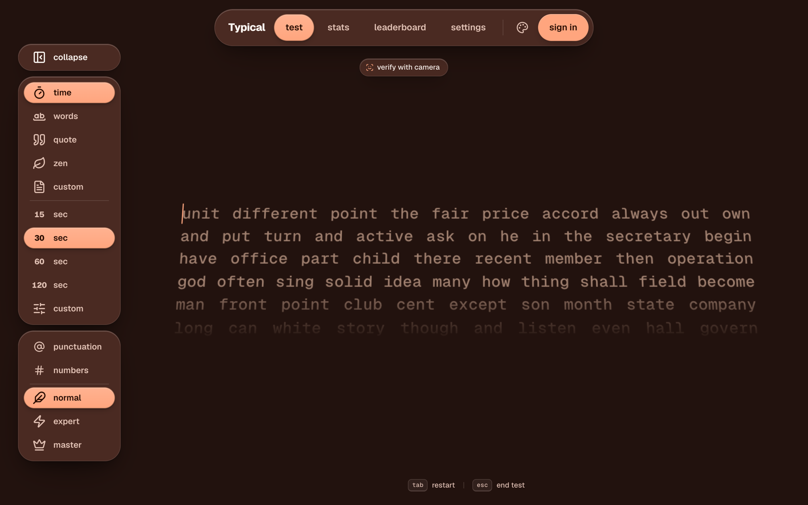</td>
</tr>
</table>

<p align="center"><sub><b>basil</b> · <b>cannoli</b> · <b>pigeon</b> · <b>sunset</b> — plus <b>midnight</b>, <b>dawn</b>, <b>aurora</b> and <b>poseidon</b></sub></p>

<br>

## Privacy by construction

- **Video never leaves your browser.** The face model runs in a Web Worker on your device; the
  camera stream is never recorded, stored or uploaded.
- **Frames become a few numbers** — head angle and eye openness — used for a moment and thrown away.
- **No third-party calls.** The face-tracking model and its runtime are served from Typical itself.
- **Optional, always.** Skip the camera and every feature still works; revoke consent any time in
  settings.
- **Guest history is yours.** Without an account, runs live only in your browser — export them as
  JSON or clear them from settings.

<br>

## Under the hood

- **Gaze integrity** — MediaPipe's FaceLandmarker in a Web Worker, calibrated per session, reduced
  to head pose and eye state, with a heuristic tuned to flag sustained looks down rather than noise.
- **A deterministic engine** — the same settings and seed always produce the same words, which is
  what makes **repeat** replay the exact same test.
- **Fair ranking** — runs are validated server-side for physical plausibility and inhuman timing;
  only signed-in, live, non-zen runs are leaderboard-eligible.
- **Works offline-first** — guests get the full app on IndexedDB; signing in syncs runs and personal
  bests, and pulls in history you typed as a guest.
- **Built with** Next.js 16 · React 19 · TypeScript · Tailwind CSS v4 · Framer Motion · Prisma +
  PostgreSQL · Auth.js.

<br>

## Run it locally

```sh
npm install
npm run dev        # http://localhost:3000
```

That's the whole app in guest mode. For accounts and the leaderboard, set `DATABASE_URL` and
`AUTH_SECRET` (see `.env.example`) and run `npm run db:push`. The camera needs `localhost` or
HTTPS.

<br>

## License

MIT

<br>

<div align="center">

**[Start typing →](https://typical-beige.vercel.app)**

<br>

</div>
